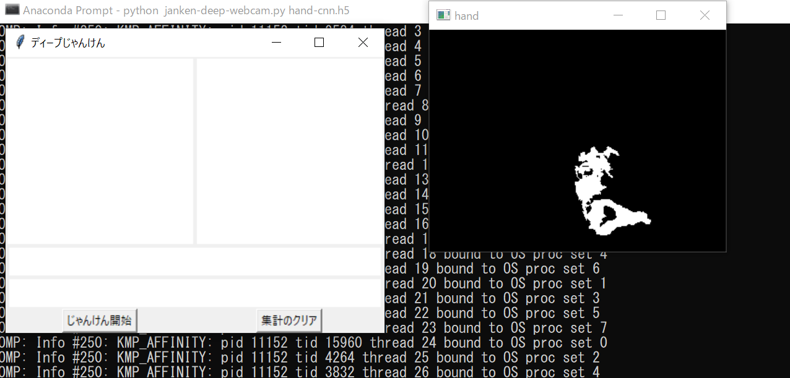

# 最強じゃんけんAIマシーンを作る

## Introduction
東京大学大学院
「医用画像・医用磁性 (電気系工学専攻)」および「生体計測工学(バイオエンジニアリング専攻)」のグループワーク

## webcamお試しプログラムの使い方
Go to the top of the local repository

```bash
cd BioSensing_AI     # go to the local repository
```

### Update Local Repository

Please update the local repository on your computer

```bash
git checkout main   # set main branch as the current branch
git fetch origin main    # download the main branch from remote repository
git reset --hard origin/main  # reset the local main branch same as remote repository
```

### Install libraries
```bash
pip  install -r requirements.txt
```

### Run the program
```bash
python janken-deep-webcam.py hand-cnn.h5
```



## Gitの使い方
### Go to Local Repository

if you don't have the local repository, clone it from the remote repository

```bash
git clone https://github.com/DaikiTsuzuki/BioSensing_AI.git
```

Go to the top of the local repository

```bash
cd BioSensing_AI     # go to the local repository
```


### Update Local Repository

Please update the local repository on your computer

```bash
git checkout main   # set main branch as the current branch
git fetch origin main    # download the main branch from remote repository
git reset --hard origin/main  # reset the local main branch same as remote repository
```


To edit code, you need to be in the branch `bevelop`.  You can always check your the current branch by

```bash
git branch -a   # list all branches, showing the current branch 
```

You are probably in the `main` branch. Let's set the `develop` branch as the current branch.

```bash
git checkout develop  # switch into the develop branch
git branch -a   # make sure you are in the deveiop branch
```


### Submit

Finally, you submit files by pushing to the `develop` branch of the remote repository. 
Make sure that you are in'develop' branch. Do not push to the 'main' branch.

```bash
cd BioSensing_AI    # go to the top of the repository
git status  # check the changes
git add .   # stage the changes
git status  # check the staged changes
git commit -m "what you did"   # the comment can be anything
git push --set-upstream origin develop  # up date the develop branch of the remote repository
```

go to the GitHub webpage `https://github.com/DaikiTsuzuki/BioSensing_AI` and make a pull request. 


----

